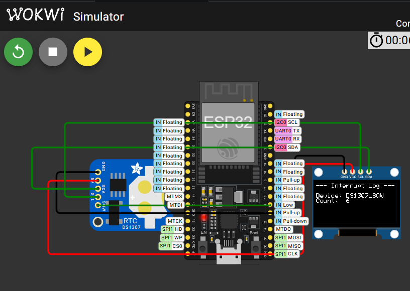

# ESP32 MCU 韌體開發練習：I2C 協議與硬體中斷

本專案是一個基於 ESP32 MCU 的韌體底層開發練習，模擬了嵌入式系統在開機自檢階段的設備掃描流程，並實作了中斷事件處理機制。

## 核心開發重點

* **I2C 匯流排掃描與通訊**：模擬嵌入式系統掃描硬體位址，確保週邊設備（OLED 螢幕、DS1307 RTC）正確掛載。
* **硬體中斷（Hardware Interrupt）**：使用 `attachInterrupt` 捕捉 DS1307 產生的 1Hz 方波訊號，實作高效能的非阻塞式（Non-blocking）事件處理。
* **底層暫存器操作**：手動透過 I2C 指令配置 DS1307 的控制暫存器（Control Register）以啟動 SQW 輸出。
* **效能優化與同步**：使用 `IRAM_ATTR` 確保中斷服務程式（ISR）運行速度，並透過 `volatile` 關鍵字處理跨執行緒變數同步。


## 硬體架構

### 系統配置圖


### 元件清單
1.  **開發板**：ESP32 DevKit V4
2.  **顯示器**：SSD1306 OLED (128x64, I2C 介面)
3.  **時鐘模組**：DS1307 RTC (用於產生硬體中斷訊號)


### 腳位定義 (Pinout)
| 元件 | 腳位名稱 | ESP32 GPIO | 說明 |
| :--- | :--- | :--- | :--- |
| **I2C Bus** | SDA | GPIO 21 | 資料傳輸 |
| **I2C Bus** | SCL | GPIO 22 | 時鐘訊號 |
| **DS1307** | SQW | **GPIO 4** | 中斷觸發來源 (1Hz) |
| **系統電源** | VCC / GND | 5V / GND | 硬體供電 |


## 軟體邏輯流程

### 1. 初始化與掃描 (Boot & Scan)
系統啟動時會執行 `scanI2CBus()`。這是一個模擬系統尋找設備的過程，透過發送起始訊號至位址 `1-127` 並等待 `ACK` 回應，確認 OLED (0x3C) 與 RTC (0x68) 是否在線上。

### 2. 中斷驅動機制 (Interrupt Mechanism)
本專案不使用 `loop()` 輪詢（Polling）硬體狀態，而是配置 `INTERRUPT_PIN` 為 `FALLING` 觸發。
* **ISR (Interrupt Service Routine)**：當 DS1307 每秒發送一個低電位脈衝時，`handleDeviceInterrupt()` 會立即被執行。
* **狀態旗標**：ISR 僅標記 `deviceEventTriggered = true`，耗時的 OLED 更新與邏輯處理則留在主迴圈執行。

### 3. 暫存器配置範例
程式碼片段展示了如何直接對硬體位址寫入 Hex 值來改變硬體行為：
```cpp
Wire.beginTransmission(0x68); // RTC 位址
Wire.write(0x07);             // 切換至控制暫存器
Wire.write(0x10);             // 寫入 00010000 (開啟 SQWE, 頻率 1Hz)
Wire.endTransmission();
```

## 如何執行

1.  **環境準備**：安裝 [Wokwi](https://wokwi.com) 模擬器。
2.  **函式庫依賴**：
    * `Adafruit_GFX_Library`
    * `Adafruit_SSD1306`
3.  **編譯**：
    * 上傳 `main.cpp`。
4.  **預期結果**：
    * 序列埠顯示 I2C 設備掃描清單。
    * OLED 螢幕每秒更新一次 "Interrupt Log"，顯示目前捕捉到的中斷總次數。
